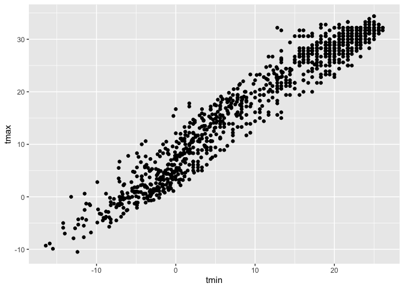
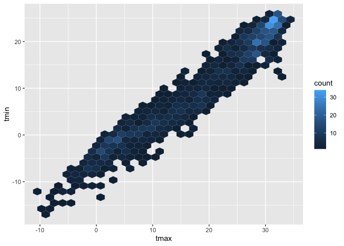
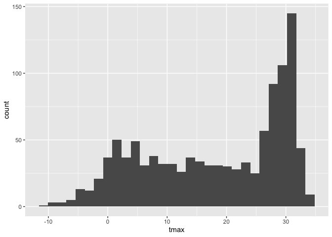
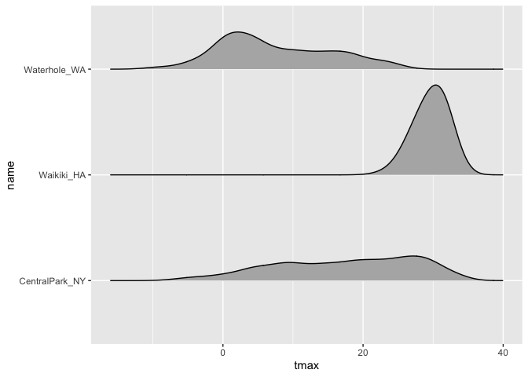

Visualization with ggplot2 (1)
================
Zoey Zhao
10/5/2021

``` r
library(tidyverse)
library(ggridges)
```

``` r
weather_df = 
  rnoaa::meteo_pull_monitors(
    c("USW00094728", "USC00519397", "USS0023B17S"),
    var = c("PRCP", "TMIN", "TMAX"), 
    date_min = "2017-01-01",
    date_max = "2017-12-31") %>%
  mutate(
    name = recode(
      id, 
      USW00094728 = "CentralPark_NY", 
      USC00519397 = "Waikiki_HA",
      USS0023B17S = "Waterhole_WA"),
    tmin = tmin / 10,
    tmax = tmax / 10) %>%
  select(name, id, everything())
```

## Scatterplot

tmax vs tmin

``` r
weather_df %>%
  ggplot(aes(x = tmin, y = tmax)) + geom_point()
```

<!-- --> you
can save ggplots

``` r
ggp_tmax_tmin <-
  weather_df %>%
  ggplot(aes(x = tmin, y = tmax)) + geom_point()

ggp_tmax_tmin
```

<!-- --> \#\#
Let’s fancy it up

Ass … color? lines? other studd?

``` r
ggplot(weather_df, aes(x = tmin, y = tmax)) + 
  geom_point(aes(color = name), alpha = 0.5)+
  geom_smooth(se =FALSE)
```

    ## `geom_smooth()` using method = 'gam' and formula 'y ~ s(x, bs = "cs")'

    ## Warning: Removed 15 rows containing non-finite values (stat_smooth).

    ## Warning: Removed 15 rows containing missing values (geom_point).

<!-- -->

``` r
ggplot(weather_df, aes(x = tmin, y = tmax, color = name)) + 
  geom_point(alpha = .5) +
  geom_smooth(se = FALSE) + 
  facet_grid(. ~ name)
```

    ## `geom_smooth()` using method = 'loess' and formula 'y ~ x'

<!-- -->

``` r
ggplot(weather_df, aes(x = date, y = tmax, color = name)) + 
  geom_point(aes(size = prcp), alpha = .5) +
  geom_smooth(se = FALSE) + 
  facet_grid(. ~ name)
```

    ## `geom_smooth()` using method = 'loess' and formula 'y ~ x'

    ## Warning: Removed 3 rows containing non-finite values (stat_smooth).

    ## Warning: Removed 3 rows containing missing values (geom_point).

<!-- -->

## Use data manipulation as part of this

``` r
weather_df %>% 
  filter(name == "CentralPark_NY") %>% 
  mutate(
    tmax_fahr = tmax * (9 / 5) + 32,
    tmin_fahr = tmin * (9 / 5) + 32) %>% 
  ggplot(aes(x = tmin_fahr, y = tmax_fahr)) +
  geom_point(alpha = .5) + 
  geom_smooth(method = "lm", se = FALSE)
```

<!-- -->

## Stacking geoms

Which geoms do you want?

``` r
weather_df %>%
  ggplot(aes(x = date, y = tmax, color = name))+
  geom_smooth()
```

    ## `geom_smooth()` using method = 'loess' and formula 'y ~ x'

    ## Warning: Removed 3 rows containing non-finite values (stat_smooth).

<!-- -->

``` r
ggplot(weather_df, aes(x = tmax, y = tmin)) + 
  geom_hex()
```

    ## Warning: Removed 15 rows containing non-finite values (stat_binhex).

<!-- --> \#\#
Univariate plots

``` r
ggplot(weather_df, aes(x = tmax)) + 
  geom_histogram()
```

<!-- -->

``` r
ggplot(weather_df, aes(x = tmax, fill = name)) + 
  geom_histogram(position = "dodge", binwidth = 2)
```

<!-- -->

``` r
ggplot(weather_df, aes(x = tmax, fill = name)) + 
  geom_density(alpha = .4, adjust = .5, color = "blue")
```

<!-- -->

``` r
#Violin plots
ggplot(weather_df, aes(x = name, y = tmax)) + 
  geom_violin(aes(fill = name), alpha = .5) + 
  stat_summary(fun = "median", color = "blue")
```

<!-- -->

``` r
#Ridge plots
ggplot(weather_df, aes(x = tmax, y = name)) + 
  geom_density_ridges(scale = .85)
```

<!-- -->
