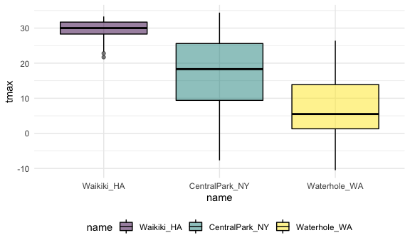
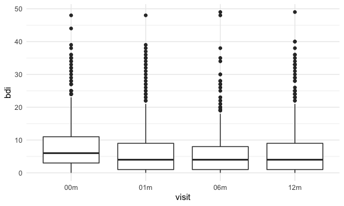

Visualization with ggplot (2)
================
Zoey Zhao
10/7/2021

``` r
library(tidyverse)
library(patchwork)
```

``` r
weather_df = 
  rnoaa::meteo_pull_monitors(
    c("USW00094728", "USC00519397", "USS0023B17S"),
    var = c("PRCP", "TMIN", "TMAX"), 
    date_min = "2017-01-01",
    date_max = "2017-12-31") %>%
  mutate(
    name = recode(
      id, 
      USW00094728 = "CentralPark_NY", 
      USC00519397 = "Waikiki_HA",
      USS0023B17S = "Waterhole_WA"),
    tmin = tmin / 10,
    tmax = tmax / 10) %>%
  select(name, id, everything())
```

    ## Registered S3 method overwritten by 'hoardr':
    ##   method           from
    ##   print.cache_info httr

    ## using cached file: ~/Library/Caches/R/noaa_ghcnd/USW00094728.dly

    ## date created (size, mb): 2021-10-05 10:30:23 (7.602)

    ## file min/max dates: 1869-01-01 / 2021-10-31

    ## using cached file: ~/Library/Caches/R/noaa_ghcnd/USC00519397.dly

    ## date created (size, mb): 2021-10-05 10:30:29 (1.697)

    ## file min/max dates: 1965-01-01 / 2020-02-29

    ## using cached file: ~/Library/Caches/R/noaa_ghcnd/USS0023B17S.dly

    ## date created (size, mb): 2021-10-05 10:30:31 (0.912)

    ## file min/max dates: 1999-09-01 / 2021-09-30

``` r
weather_df %>% 
  ggplot(aes(x = tmin, y = tmax)) + 
  geom_point(aes(color = name), alpha = .5)
```

<!-- --> \#\#
Labels

``` r
weather_df %>% 
  ggplot(aes(x = tmin, y = tmax)) + 
  geom_point(aes(color = name), alpha = .5) + 
  labs(
    title = "Temperature plot",
    x = "Minimum daily temperature (C)",
    y = "Maxiumum daily temperature (C)",
    caption = "Data from the rnoaa package"
  )
```

<!-- --> \#\#
Scales

``` r
weather_df %>% 
  ggplot(aes(x = tmin, y = tmax)) + 
  geom_point(aes(color = name), alpha = .5) + 
  labs(
    title = "Temperature plot",
    x = "Minimum daily temperature (C)",
    y = "Maxiumum daily temperature (C)",
    caption = "Data from the rnoaa package") + 
  scale_x_continuous(
    breaks = c(-15, 0, 15), 
    labels = c("-15º C", "0", "15"))
```

<!-- -->

``` r
weather_df %>% 
  ggplot(aes(x = tmin, y = tmax)) + 
  geom_point(aes(color = name), alpha = .5) + 
  labs(
    title = "Temperature plot",
    x = "Minimum daily temperature (C)",
    y = "Maxiumum daily temperature (C)",
    caption = "Data from the rnoaa package") + 
  scale_x_continuous(
    breaks = c(-15, 0, 15), 
    labels = c("-15ºC", "0", "15"),
    limits = c(-20, 30)) + 
  scale_y_continuous(
    trans = "sqrt", 
    position = "right")
```

    ## Warning in self$trans$transform(x): NaNs produced

    ## Warning: Transformation introduced infinite values in continuous y-axis

    ## Warning: Removed 90 rows containing missing values (geom_point).

<!-- -->
Arguments to `scale_color_hue()` control the color scale and the name in
the plot legend.

``` r
weather_df %>% 
  ggplot(aes(x = tmin, y = tmax)) + 
  geom_point(aes(color = name), alpha = .5) + 
  labs(
    title = "Temperature plot",
    x = "Minimum daily temperature (C)",
    y = "Maxiumum daily temperature (C)",
    caption = "Data from the rnoaa package") + 
  scale_color_hue(name = "Location", h = c(100, 300))
```

    ## Warning: Removed 15 rows containing missing values (geom_point).

<!-- --> Use
the `viridis` package

``` r
ggp_temp_plot = 
  weather_df %>% 
  ggplot(aes(x = tmin, y = tmax)) + 
  geom_point(aes(color = name), alpha = .5) + 
  labs(
    title = "Temperature plot",
    x = "Minimum daily temperature (C)",
    y = "Maxiumum daily temperature (C)",
    caption = "Data from the rnoaa package"
  ) + 
  viridis::scale_color_viridis(
    name = "Location", 
    discrete = TRUE
  )

ggp_temp_plot
```

    ## Warning: Removed 15 rows containing missing values (geom_point).

<!-- --> \#\#
Themes

``` r
ggp_temp_plot + 
  theme(legend.position = "bottom")
```

    ## Warning: Removed 15 rows containing missing values (geom_point).

<!-- -->

``` r
ggp_temp_plot + 
  theme_bw() + 
  theme(legend.position = "bottom")
```

    ## Warning: Removed 15 rows containing missing values (geom_point).

<!-- -->

``` r
ggp_temp_plot + 
  theme_classic() + 
  theme(legend.position = "bottom")
```

    ## Warning: Removed 15 rows containing missing values (geom_point).

<!-- -->

``` r
ggplot(weather_df, aes(x = date, y = tmax, color = name)) + 
  geom_smooth(se = FALSE) + 
  geom_point(aes(size = prcp), alpha = .75) + 
  labs(
    title = "Temperature plot",
    x = "Date",
    y = "Maxiumum daily temperature (C)",
    caption = "Data from the rnoaa package"
  ) + 
  viridis::scale_color_viridis(discrete = TRUE) + 
  theme_minimal() + 
  theme(legend.position = "bottom")
```

    ## `geom_smooth()` using method = 'loess' and formula 'y ~ x'

    ## Warning: Removed 3 rows containing non-finite values (stat_smooth).

    ## Warning: Removed 3 rows containing missing values (geom_point).

<!-- -->

## Setting options

This code chunk just gets copy-and-pasted to the beginning of every new
file

``` r
library(tidyverse)

knitr::opts_chunk$set(
  fig.width = 6,
  fig.asp = .6,
  out.width = "90%"
)

theme_set(theme_minimal() + theme(legend.position = "bottom"))

options(
  ggplot2.continuous.colour = "viridis",
  ggplot2.continuous.fill = "viridis"
)

scale_colour_discrete = scale_colour_viridis_d
scale_fill_discrete = scale_fill_viridis_d
```

## Data argument in `geom_*`

``` r
central_park = 
  weather_df %>% 
  filter(name == "CentralPark_NY")

waikiki = 
  weather_df %>% 
  filter(name == "Waikiki_HA")

ggplot(data = waikiki, aes(x = date, y = tmax, color = name)) + 
  geom_point() + 
  geom_line(data = central_park)
```

    ## Warning: Removed 3 rows containing missing values (geom_point).


\#\# `patchwork`

``` r
tmax_tmin_p = 
  weather_df %>% 
  ggplot(aes(x = tmax, y = tmin, color = name)) + 
  geom_point(alpha = .5) +
  theme(legend.position = "none")

prcp_dens_p = 
  weather_df %>% 
  filter(prcp > 0) %>% 
  ggplot(aes(x = prcp, fill = name)) + 
  geom_density(alpha = .5) + 
  theme(legend.position = "none")

tmax_date_p = 
  weather_df %>% 
  ggplot(aes(x = date, y = tmax, color = name)) + 
  geom_point(alpha = .5) +
  geom_smooth(se = FALSE) + 
  theme(legend.position = "bottom")

(tmax_tmin_p + prcp_dens_p) / tmax_date_p
```

    ## Warning: Removed 15 rows containing missing values (geom_point).

    ## `geom_smooth()` using method = 'loess' and formula 'y ~ x'

    ## Warning: Removed 3 rows containing non-finite values (stat_smooth).

    ## Warning: Removed 3 rows containing missing values (geom_point).


## Data Manipulation

``` r
weather_df %>%
  mutate(name = forcats::fct_relevel(name, c("Waikiki_HA", "CentralPark_NY", "Waterhole_WA"))) %>% 
  ggplot(aes(x = name, y = tmax)) + 
  geom_boxplot(aes(fill = name), color = "black", alpha = .5) + 
  theme(legend.position = "bottom")
```

    ## Warning: Removed 3 rows containing non-finite values (stat_boxplot).



``` r
weather_df %>%
  mutate(name = forcats::fct_reorder(name, tmax)) %>% 
  ggplot(aes(x = name, y = tmax)) + 
  geom_boxplot(aes(fill = name), color = "black", alpha = .5) + 
  theme(legend.position = "bottom")
```

    ## Warning: Removed 3 rows containing non-finite values (stat_boxplot).


``` r
weather_df %>%
  select(name, tmax, tmin) %>% 
  pivot_longer(
    tmax:tmin,
    names_to = "observation", 
    values_to = "temp") %>% 
  ggplot(aes(x = temp, fill = observation)) +
  geom_density(alpha = .5) + 
  facet_grid(~name) + 
  viridis::scale_fill_viridis(discrete = TRUE)
```

    ## Warning: Removed 18 rows containing non-finite values (stat_density).


\#\# Other Materials

``` r
pulse_data = 
  haven::read_sas("./data/public_pulse_data.sas7bdat") %>%
  janitor::clean_names()%>%
  pivot_longer(
    bdi_score_bl:bdi_score_12m,
    names_to = "visit", 
    names_prefix = "bdi_score_",
    values_to = "bdi")%>%
  select(id, visit, everything()) %>%
  mutate(
    visit = recode(visit, "bl" = "00m"),
    visit = factor(visit, levels = str_c(c("00", "01", "06", "12"), "m"))) %>%
  arrange(id, visit)
```

``` r
ggplot(pulse_data, aes(x = visit, y = bdi)) + 
  geom_boxplot()
```

    ## Warning: Removed 879 rows containing non-finite values (stat_boxplot).


